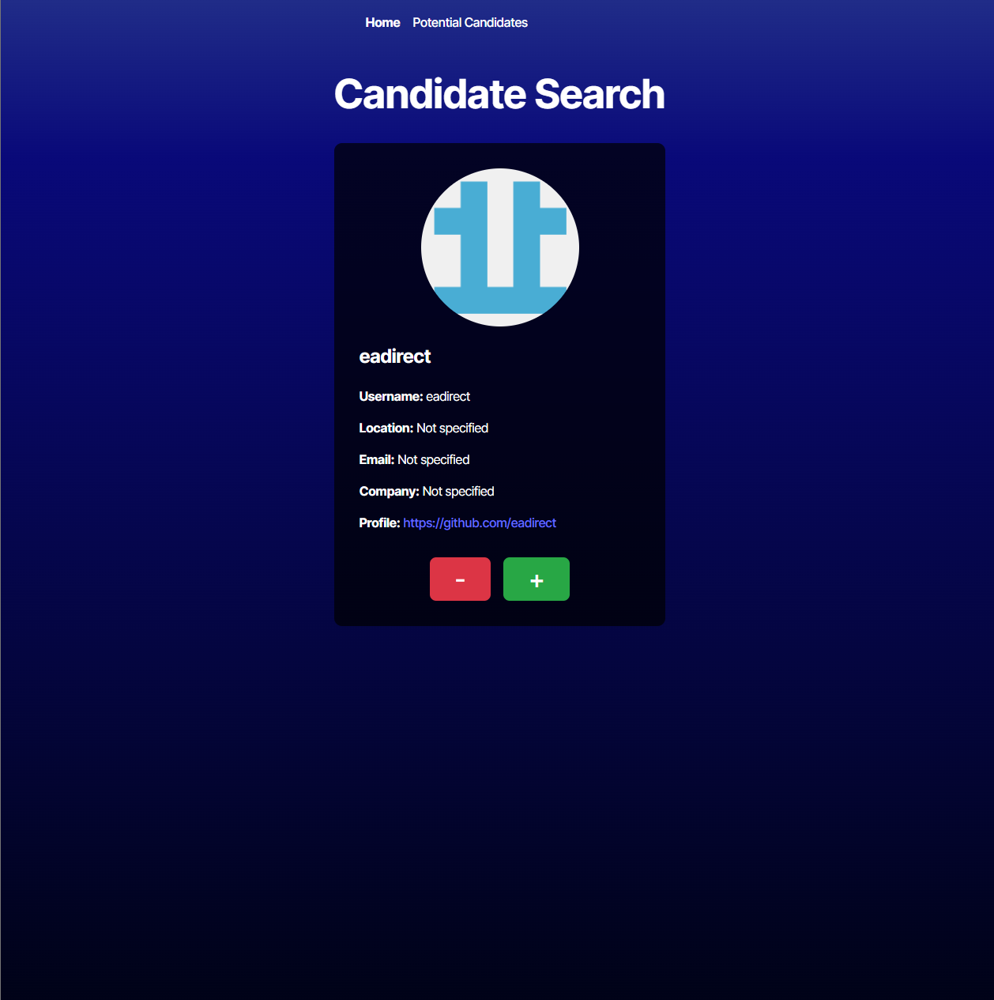

# Candidate Search Application

## Description

A TypeScript React application that allows employers to search for potential candidates using the GitHub API. Users can browse through GitHub profiles, save promising candidates to a list, and manage their selections with persistent data storage.

## Table of Contents

- [Installation](#installation)
- [Usage](#usage)
- [Features](#features)
- [Technologies](#technologies)
- [Screenshots](#screenshots)
- [Deployment](#deployment)
- [Contributing](#contributing)
- [License](#license)
- [Contact](#contact)

## Installation

1. Clone the repository:
   git clone <https://github.com/jadenszewczak/candidate-search-app.git>

2. Navigate to the project directory:
   cd candidate-search-app/Develop

3. Install dependencies:
   npm install

4. Create a `.env` file in the `environment` folder:
   VITE_GITHUB_TOKEN=your_github_personal_access_token

5. Start the development server:
   npm run dev

## Usage

1. **Browse Candidates**: The home page displays one candidate at a time with their GitHub information
2. **Save Candidates**: Click the "+" button to save a candidate to your potential candidates list
3. **Skip Candidates**: Click the "-" button to skip to the next candidate without saving
4. **View Saved**: Navigate to "Potential Candidates" to see all saved candidates
5. **Remove Saved**: Click the "-" button on the saved candidates page to remove them from your list

## Features

- ✨ Real-time candidate search using GitHub API
- 💾 Persistent storage using localStorage
- 🔄 Automatic loading of new candidates
- 📱 Responsive design for all devices
- 🎨 Clean, modern UI with dark theme
- ⚡ Fast performance with Vite
- 🔒 Type-safe with TypeScript

## Technologies

- **Frontend**: React 18 with TypeScript
- **Build Tool**: Vite
- **Routing**: React Router DOM
- **Styling**: CSS3 with CSS Variables
- **API**: GitHub REST API
- **Storage**: Browser localStorage
- **Deployment**: Render

## Screenshots

_Main search interface showing candidate information_

## Deployment

🚀 **Live Application**: [https://candidate-search-app-j07q.onrender.com/](https://candidate-search-app-j07q.onrender.com/)

## Contributing

1. Fork the repository
2. Create your feature branch (`git checkout -b feature/AmazingFeature`)
3. Commit your changes (`git commit -m 'Add some AmazingFeature'`)
4. Push to the branch (`git push origin feature/AmazingFeature`)
5. Open a Pull Request

## License

This project is licensed under the MIT License - see the [LICENSE](LICENSE) file for details.

## Contact

### Jaden Szewczak

- GitHub: [@jadenszewczak](https://github.com/jadenszewczak)
- Project Link: [https://github.com/jadenszewczak/candidate-search-app](https://github.com/jadenszewczak/candidate-search-app)
